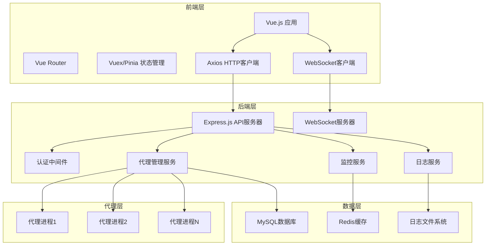

# 设计文档

## 概述

Agent管理系统采用前后端分离的架构设计，使用Vue.js构建响应式前端界面，Node.js + Express.js构建RESTful API后端服务，MySQL作为主数据库存储代理配置、状态和日志信息。系统支持实时监控、WebSocket通信和基于JWT的身份认证。

## 架构

### 系统架构图



### 技术栈

**前端:**
- Vue.js 3 - 主框架
- Vue Router - 路由管理
- Pinia - 状态管理
- Element Plus - UI组件库
- Axios - HTTP请求
- Socket.io-client - WebSocket通信
- Chart.js - 图表展示

**后端:**
- Node.js - 运行时环境
- Express.js - Web框架
- Socket.io - WebSocket服务
- Sequelize - ORM框架
- JWT - 身份认证
- bcrypt - 密码加密
- node-cron - 定时任务
- winston - 日志记录

**数据库:**
- MySQL 8.0 - 主数据库
- Redis - 缓存和会话存储

## 组件和接口

### 前端组件结构

```
src/
├── components/
│   ├── common/
│   │   ├── Header.vue
│   │   ├── Sidebar.vue
│   │   └── Loading.vue
│   ├── agent/
│   │   ├── AgentList.vue
│   │   ├── AgentCard.vue
│   │   ├── AgentForm.vue
│   │   └── AgentDetail.vue
│   ├── monitoring/
│   │   ├── Dashboard.vue
│   │   ├── MetricsChart.vue
│   │   └── AlertPanel.vue
│   └── logs/
│       ├── LogViewer.vue
│       └── LogFilter.vue
├── views/
│   ├── Dashboard.vue
│   ├── AgentManagement.vue
│   ├── Monitoring.vue
│   ├── Logs.vue
│   └── Settings.vue
├── store/
│   ├── modules/
│   │   ├── auth.js
│   │   ├── agents.js
│   │   ├── monitoring.js
│   │   └── logs.js
│   └── index.js
└── services/
    ├── api.js
    ├── websocket.js
    └── auth.js
```

### 后端服务结构

```
src/
├── controllers/
│   ├── authController.js
│   ├── agentController.js
│   ├── monitoringController.js
│   └── logController.js
├── services/
│   ├── agentService.js
│   ├── monitoringService.js
│   ├── logService.js
│   └── authService.js
├── models/
│   ├── User.js
│   ├── Agent.js
│   ├── AgentTemplate.js
│   ├── AgentLog.js
│   └── AgentMetrics.js
├── middleware/
│   ├── auth.js
│   ├── validation.js
│   └── errorHandler.js
├── routes/
│   ├── auth.js
│   ├── agents.js
│   ├── monitoring.js
│   └── logs.js
├── utils/
│   ├── logger.js
│   ├── processManager.js
│   └── validator.js
└── websocket/
    └── socketHandlers.js
```

### API接口设计

**认证接口:**
- POST /api/auth/login - 用户登录
- POST /api/auth/logout - 用户登出
- POST /api/auth/refresh - 刷新令牌
- GET /api/auth/profile - 获取用户信息

**代理管理接口:**
- GET /api/agents - 获取代理列表
- POST /api/agents - 创建新代理
- GET /api/agents/:id - 获取代理详情
- PUT /api/agents/:id - 更新代理配置
- DELETE /api/agents/:id - 删除代理
- POST /api/agents/:id/start - 启动代理
- POST /api/agents/:id/stop - 停止代理
- POST /api/agents/:id/restart - 重启代理

**监控接口:**
- GET /api/monitoring/dashboard - 获取仪表板数据
- GET /api/monitoring/agents/:id/metrics - 获取代理性能指标
- GET /api/monitoring/alerts - 获取告警信息
- POST /api/monitoring/alerts/:id/acknowledge - 确认告警

**日志接口:**
- GET /api/logs - 获取日志列表
- GET /api/logs/search - 搜索日志
- GET /api/logs/export - 导出日志
- GET /api/logs/stream - 实时日志流

**模板接口:**
- GET /api/templates - 获取模板列表
- POST /api/templates - 创建模板
- PUT /api/templates/:id - 更新模板
- DELETE /api/templates/:id - 删除模板

## 数据模型

### 数据库表设计

**users 表:**
```sql
CREATE TABLE users (
    id INT PRIMARY KEY AUTO_INCREMENT,
    username VARCHAR(50) UNIQUE NOT NULL,
    email VARCHAR(100) UNIQUE NOT NULL,
    password_hash VARCHAR(255) NOT NULL,
    role ENUM('admin', 'operator', 'viewer') DEFAULT 'viewer',
    created_at TIMESTAMP DEFAULT CURRENT_TIMESTAMP,
    updated_at TIMESTAMP DEFAULT CURRENT_TIMESTAMP ON UPDATE CURRENT_TIMESTAMP
);
```

**agents 表:**
```sql
CREATE TABLE agents (
    id INT PRIMARY KEY AUTO_INCREMENT,
    name VARCHAR(100) NOT NULL,
    description TEXT,
    status ENUM('stopped', 'running', 'error', 'starting', 'stopping') DEFAULT 'stopped',
    config JSON NOT NULL,
    template_id INT,
    process_id INT,
    created_by INT,
    created_at TIMESTAMP DEFAULT CURRENT_TIMESTAMP,
    updated_at TIMESTAMP DEFAULT CURRENT_TIMESTAMP ON UPDATE CURRENT_TIMESTAMP,
    FOREIGN KEY (template_id) REFERENCES agent_templates(id),
    FOREIGN KEY (created_by) REFERENCES users(id)
);
```

**agent_templates 表:**
```sql
CREATE TABLE agent_templates (
    id INT PRIMARY KEY AUTO_INCREMENT,
    name VARCHAR(100) NOT NULL,
    description TEXT,
    config JSON NOT NULL,
    created_by INT,
    created_at TIMESTAMP DEFAULT CURRENT_TIMESTAMP,
    updated_at TIMESTAMP DEFAULT CURRENT_TIMESTAMP ON UPDATE CURRENT_TIMESTAMP,
    FOREIGN KEY (created_by) REFERENCES users(id)
);
```

**agent_logs 表:**
```sql
CREATE TABLE agent_logs (
    id BIGINT PRIMARY KEY AUTO_INCREMENT,
    agent_id INT NOT NULL,
    level ENUM('debug', 'info', 'warn', 'error') NOT NULL,
    message TEXT NOT NULL,
    context JSON,
    timestamp TIMESTAMP DEFAULT CURRENT_TIMESTAMP,
    FOREIGN KEY (agent_id) REFERENCES agents(id) ON DELETE CASCADE,
    INDEX idx_agent_timestamp (agent_id, timestamp),
    INDEX idx_level_timestamp (level, timestamp)
);
```

**agent_metrics 表:**
```sql
CREATE TABLE agent_metrics (
    id BIGINT PRIMARY KEY AUTO_INCREMENT,
    agent_id INT NOT NULL,
    cpu_usage DECIMAL(5,2),
    memory_usage DECIMAL(10,2),
    request_count INT DEFAULT 0,
    error_count INT DEFAULT 0,
    response_time DECIMAL(8,2),
    timestamp TIMESTAMP DEFAULT CURRENT_TIMESTAMP,
    FOREIGN KEY (agent_id) REFERENCES agents(id) ON DELETE CASCADE,
    INDEX idx_agent_timestamp (agent_id, timestamp)
);
```

### Sequelize模型定义

**Agent模型:**
```javascript
const Agent = sequelize.define('Agent', {
    name: {
        type: DataTypes.STRING(100),
        allowNull: false,
        validate: {
            notEmpty: true,
            len: [1, 100]
        }
    },
    description: DataTypes.TEXT,
    status: {
        type: DataTypes.ENUM('stopped', 'running', 'error', 'starting', 'stopping'),
        defaultValue: 'stopped'
    },
    config: {
        type: DataTypes.JSON,
        allowNull: false,
        validate: {
            isValidConfig(value) {
                // 配置验证逻辑
            }
        }
    },
    processId: DataTypes.INTEGER
});
```

## 错误处理

### 错误分类和处理策略

**前端错误处理:**
- HTTP错误 - 统一拦截器处理，显示用户友好的错误消息
- 网络错误 - 自动重试机制，离线状态提示
- 验证错误 - 表单实时验证，错误高亮显示
- 运行时错误 - 全局错误边界，错误上报

**后端错误处理:**
- 业务逻辑错误 - 返回具体错误码和消息
- 数据库错误 - 记录详细日志，返回通用错误消息
- 系统错误 - 自动告警，返回500状态码
- 验证错误 - 返回400状态码和验证失败字段

**错误码定义:**
```javascript
const ErrorCodes = {
    // 认证相关
    INVALID_CREDENTIALS: 'AUTH_001',
    TOKEN_EXPIRED: 'AUTH_002',
    INSUFFICIENT_PERMISSIONS: 'AUTH_003',
    
    // 代理相关
    AGENT_NOT_FOUND: 'AGENT_001',
    AGENT_ALREADY_RUNNING: 'AGENT_002',
    AGENT_START_FAILED: 'AGENT_003',
    INVALID_AGENT_CONFIG: 'AGENT_004',
    
    // 系统相关
    DATABASE_ERROR: 'SYS_001',
    INTERNAL_SERVER_ERROR: 'SYS_002'
};
```

## 测试策略

### 前端测试

**单元测试:**
- Vue组件测试 - Vue Test Utils + Jest
- 状态管理测试 - Pinia store测试
- 工具函数测试 - Jest单元测试

**集成测试:**
- API集成测试 - Mock API响应
- 路由测试 - Vue Router测试
- 端到端测试 - Cypress

**测试覆盖率目标:**
- 组件测试覆盖率 > 80%
- 工具函数覆盖率 > 90%
- 关键业务流程覆盖率 100%

### 后端测试

**单元测试:**
- 控制器测试 - Jest + Supertest
- 服务层测试 - Jest + Mock
- 模型测试 - Sequelize测试

**集成测试:**
- API端点测试 - 完整请求响应测试
- 数据库集成测试 - 测试数据库操作
- WebSocket测试 - Socket.io测试

**性能测试:**
- 负载测试 - Artillery.js
- 压力测试 - 并发请求测试
- 数据库性能测试 - 查询优化验证

### 测试环境配置

**测试数据库:**
- 独立的测试MySQL实例
- 每次测试前重置数据
- 测试数据种子文件

**Mock服务:**
- 外部API Mock
- 代理进程Mock
- 文件系统Mock

### 持续集成

**CI/CD流程:**
1. 代码提交触发构建
2. 运行单元测试和集成测试
3. 代码质量检查（ESLint, SonarQube）
4. 构建Docker镜像
5. 部署到测试环境
6. 运行端到端测试
7. 部署到生产环境（手动触发）

**测试报告:**
- 测试覆盖率报告
- 性能测试报告
- 安全扫描报告